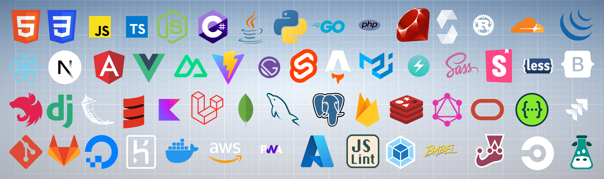

## Hi there 👋, Welcome to my github!
### I am Full Stack Blockchain Engineer | Scalable Systems | Cloud & Data Integration Pro | Agile Development Expert
#### 👊 React.js / Next.js / Angular / Vue / Solidity / Rust / Move / Golang / Node.js / Python / C# / Java / Nest.js / Django / Flask / .NET Core / Spring / Scala / Web3 / ethers / Smart Contract / Layer2 / Docker / Kubernetes / Jenkins / AWS / Azure

With a strong foundation in both front-end, back-end and blockchain technologies, I am a full-stack blockchain engineer passionate about creating robust, user-centered web2 / web3 solutions that drive business growth. My experience spans building dynamic web applications, developing microservices, utilizing web3 technologies and optimizing cloud infrastructure for high performance and scalability. Skilled in modern JavaScript frameworks, cloud platforms, and data management, I lead projects from ideation to deployment, ensuring secure, efficient, and maintainable solutions.

When I'm not coding, you'll probably find me experimenting with new tech, brainstorming ideas for side projects, or just enjoying the outdoors. I’m always open to new connections and ideas – let’s build something amazing together!

<h2><b>💻 Tech Stack</b></h2>

